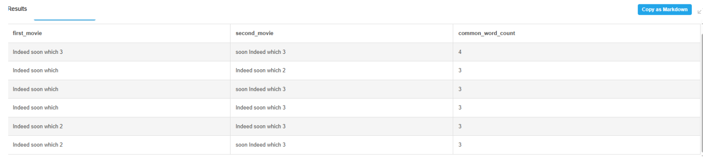

# Контрольная работа Вариант 4

## Задания: 

1. Найти пары фильмов, у которых совпадают хотя бы 3 слова.
2. Использовать регулярные выражения для фильтрации названий, содержащих цифры.
3. Добавить условие: совпадающее слово должно быть длиной не менее 5 символов.
4. Добавить подзапрос, считающий число уникальных слов в названии каждого фильма.
5. Сравнить производительность запроса до и после индексации (EXPLAIN).
6. Реализовать ту же задачу с использованием CTE.
7. Построить отдельную таблицу с частотностью слов по всем названиям фильмов


### Задание 1

Создаем временную таблицу, разбивая каждое название фильма на слова:

```postgresql
SELECT
    id,
    title,
    LOWER(unnest(string_to_array(title, ' '))) AS word
FROM movies
```

Результат:


Находим совпадения слов в названиях фильмов:

```postgresql
WITH words_per_movie AS (
   SELECT
        id,
        title,
        LOWER(unnest(string_to_array(title, ' '))) AS word
    FROM movies
)
    SELECT
        w1.id AS first_movie_id,
        w2.id AS second_movie_id,
        w1.word
    FROM words_per_movie w1
    JOIN words_per_movie w2
        ON w1.word = w2.word AND w1.id < w2.id;
```

Результат:


Получаем количество совпадений слов в парах названий фильмов:
```postgresql
SELECT
    first_movie_id,
    second_movie_id,
    COUNT(word) AS common_word_count
FROM word_pairs
GROUP BY first_movie_id, second_movie_id
ORDER BY common_word_count
```
Результат:


Получаем названия фильмов:
```postgresql
SELECT id, title FROM movies
```

Результат:


Конечный запрос:
```postgresql
WITH words_per_movie AS (
   SELECT
        id,
        title,
        LOWER(unnest(string_to_array(title, ' '))) AS word
    FROM movies
),
word_pairs AS (
    SELECT
        w1.id AS first_movie_id,
        w2.id AS second_movie_id,
        w1.word
    FROM words_per_movie w1
    JOIN words_per_movie w2
        ON w1.word = w2.word AND w1.id < w2.id
),
matching_words_count AS (
  SELECT
      first_movie_id,
      second_movie_id,
      COUNT(word) AS common_word_count
  FROM word_pairs
  GROUP BY first_movie_id, second_movie_id
  ORDER BY common_word_count
),
movie_titles AS (
    SELECT id, title FROM movies
)
SELECT 
    m1.title AS first_movie,
    m2.title AS second_movie,
    mwc.common_word_count
FROM matching_words_count mwc
JOIN movie_titles m1 ON m1.id = mwc.first_movie_id
JOIN movie_titles m2 ON m2.id = mwc.second_movie_id
WHERE mwc.common_word_count >= 3
ORDER BY mwc.common_word_count DESC;
```
Результат:


### Задание 2

Для того чтобы отфильтровать названия, которые содержат цифры, достаточно добавить фильтрацию в подзапросе получения слов:

```postgresql
WITH words_per_movie AS (
   SELECT
        id,
        title,
        LOWER(unnest(string_to_array(title, ' '))) AS word
    FROM movies
    WHERE title ~ '\d'  -- Выбирает только те названия, в которых есть цифры
)
```

Конечный запрос:
```postgresql
WITH words_per_movie AS (
   SELECT
        id,
        title,
        LOWER(unnest(string_to_array(title, ' '))) AS word
    FROM movies
    WHERE title ~ '\d'  -- Выбирает только те названия, в которых есть цифры
),
word_pairs AS (
    SELECT
        w1.id AS first_movie_id,
        w2.id AS second_movie_id,
        w1.word
    FROM words_per_movie w1
    JOIN words_per_movie w2
        ON w1.word = w2.word AND w1.id < w2.id
),
matching_words_count AS (
  SELECT
      first_movie_id,
      second_movie_id,
      COUNT(word) AS common_word_count
  FROM word_pairs
  GROUP BY first_movie_id, second_movie_id
  ORDER BY common_word_count
),
movie_titles AS (
    SELECT id, title FROM movies
)
SELECT 
    m1.title AS first_movie,
    m2.title AS second_movie,
    mwc.common_word_count
FROM matching_words_count mwc
JOIN movie_titles m1 ON m1.id = mwc.first_movie_id
JOIN movie_titles m2 ON m2.id = mwc.second_movie_id
WHERE mwc.common_word_count >= 3
ORDER BY mwc.common_word_count DESC;
```
Результат:

### Задание 3

Для того, чтобы отфильтровать названия, которые содержат цифры, достаточно добавить фильтрацию в подзапросе получения совпадений слов в парах:
```postgresql
SELECT
    w1.id AS first_movie_id,
    w2.id AS second_movie_id,
    w1.word
FROM words_per_movie w1
JOIN words_per_movie w2
    ON w1.word = w2.word AND char_length(w1.word) >=5 AND w1.id < w2.id
```
Конечный запрос:

```postgresql
WITH words_per_movie AS (
   SELECT
        id,
        title,
        LOWER(unnest(string_to_array(title, ' '))) AS word
    FROM movies
    WHERE title ~ '\d'  -- Выбирает только те названия, в которых есть цифры
),
word_pairs AS (
    SELECT
        w1.id AS first_movie_id,
        w2.id AS second_movie_id,
        w1.word
    FROM words_per_movie w1
    JOIN words_per_movie w2
        ON w1.word = w2.word AND char_length(w1.word) >=5 AND w1.id < w2.id
),
matching_words_count AS (
  SELECT
      first_movie_id,
      second_movie_id,
      COUNT(word) AS common_word_count
  FROM word_pairs
  GROUP BY first_movie_id, second_movie_id
  ORDER BY common_word_count
),
movie_titles AS (
    SELECT id, title FROM movies
)
SELECT 
    m1.title AS first_movie,
    m2.title AS second_movie,
    mwc.common_word_count
FROM matching_words_count mwc
JOIN movie_titles m1 ON m1.id = mwc.first_movie_id
JOIN movie_titles m2 ON m2.id = mwc.second_movie_id
WHERE mwc.common_word_count >= 3
ORDER BY mwc.common_word_count DESC;
```
Результат:


### Задание 4
Для этого необходимо добавить еще один подзапрос, считающий количество всех уникальных слов в названии:
```postgresql
SELECT
    id,
    title,
    COUNT(DISTINCT word) AS unique_words_count
FROM words_per_movie
GROUP BY id, title
ORDER BY unique_words_count DESC;
```

Конечный запрос:
```postgresql
WITH words_per_movie AS (
   SELECT
        id,
        title,
        LOWER(unnest(string_to_array(title, ' '))) AS word
    FROM movies
    WHERE title ~ '\d'  -- Выбирает только те названия, в которых есть цифры
),

word_pairs AS (
    SELECT
        w1.id AS first_movie_id,
        w2.id AS second_movie_id,
        w1.word
    FROM words_per_movie w1
    JOIN words_per_movie w2
        ON w1.word = w2.word AND char_length(w1.word) >=5 AND w1.id < w2.id
),

unique_words AS (
  SELECT
    id,
    title,
    COUNT(DISTINCT word) AS unique_words_count
	FROM words_per_movie
GROUP BY id, title
ORDER BY unique_words_count DESC
),

matching_words_count AS (
  SELECT
      first_movie_id,
      second_movie_id,
      COUNT(word) AS common_word_count
  FROM word_pairs
  GROUP BY first_movie_id, second_movie_id
  ORDER BY common_word_count
),

movie_titles AS (
    SELECT id, title FROM movies
)

SELECT 
    m1.title AS first_movie,
    m2.title AS second_movie,
    mwc.common_word_count,
    u1.unique_words_count AS first_unique_words,
    u2.unique_words_count  AS second_unique_words
FROM matching_words_count mwc
JOIN movie_titles m1 ON m1.id = mwc.first_movie_id
JOIN movie_titles m2 ON m2.id = mwc.second_movie_id
JOIN unique_words u1 ON u1.id = mwc.first_movie_id
JOIN unique_words u2 ON u2.id = mwc.second_movie_id
WHERE mwc.common_word_count >= 3
ORDER BY mwc.common_word_count DESC;
```
Результат: 


### Задание 5
Explain-запрос до индексирования:

| QUERY PLAN                                                                                                                                                 |
| ---------------------------------------------------------------------------------------------------------------------------------------------------------- |
| Sort  (cost=1324.34..1331.40 rows=2825 width=314) (actual time=0.341..0.344 rows=3 loops=1)                                                                |
|   Sort Key: (count(w1.word)) DESC                                                                                                                          |
|   Sort Method: quicksort  Memory: 25kB                                                                                                                     |
|   CTE words_per_movie                                                                                                                                      |
|     ->  Result  (cost=0.00..71.88 rows=2500 width=181) (actual time=0.042..0.051 rows=16 loops=1)                                                          |
|           ->  ProjectSet  (cost=0.00..28.12 rows=2500 width=181) (actual time=0.038..0.043 rows=16 loops=1)                                                |
|                 ->  Seq Scan on movies  (cost=0.00..13.12 rows=250 width=149) (actual time=0.030..0.032 rows=4 loops=1)                                    |
|                       Filter: ((title)::text ~ '\d'::text)                                                                                                 |
|                       Rows Removed by Filter: 49                                                                                                           |
|   CTE unique_words                                                                                                                                         |
|     ->  Sort  (cost=228.55..229.18 rows=250 width=157) (actual time=0.081..0.082 rows=4 loops=1)                                                           |
|           Sort Key: (count(DISTINCT words_per_movie.word)) DESC                                                                                            |
|           Sort Method: quicksort  Memory: 25kB                                                                                                             |
|           ->  GroupAggregate  (cost=191.10..218.60 rows=250 width=157) (actual time=0.072..0.076 rows=4 loops=1)                                           |
|                 Group Key: words_per_movie.id, words_per_movie.title                                                                                       |
|                 ->  Sort  (cost=191.10..197.35 rows=2500 width=181) (actual time=0.067..0.068 rows=16 loops=1)                                             |
|                       Sort Key: words_per_movie.id, words_per_movie.title, words_per_movie.word                                                            |
|                       Sort Method: quicksort  Memory: 25kB                                                                                                 |
|                       ->  CTE Scan on words_per_movie  (cost=0.00..50.00 rows=2500 width=181) (actual time=0.043..0.054 rows=16 loops=1)                   |
|   CTE movie_titles                                                                                                                                         |
|     ->  Seq Scan on movies movies_1  (cost=0.00..12.50 rows=250 width=149) (actual time=0.006..0.010 rows=53 loops=1)                                      |
|   ->  Hash Join  (cost=665.84..848.85 rows=2825 width=314) (actual time=0.325..0.329 rows=3 loops=1)                                                       |
|         Hash Cond: (w1.id = m1.id)                                                                                                                         |
|         ->  Hash Join  (cost=637.25..717.49 rows=1808 width=165) (actual time=0.175..0.177 rows=3 loops=1)                                                 |
|               Hash Cond: (w2.id = m2.id)                                                                                                                   |
|               ->  Sort  (cost=608.67..611.56 rows=1157 width=16) (actual time=0.099..0.100 rows=3 loops=1)                                                 |
|                     Sort Key: (count(w1.word))                                                                                                             |
|                     Sort Method: quicksort  Memory: 25kB                                                                                                   |
|                     ->  HashAggregate  (cost=506.41..549.80 rows=1157 width=16) (actual time=0.072..0.082 rows=3 loops=1)                                  |
|                           Group Key: w1.id, w2.id                                                                                                          |
|                           Filter: (count(w1.word) >= 3)                                                                                                    |
|                           Batches: 1  Memory Usage: 121kB                                                                                                  |
|                           Rows Removed by Filter: 3                                                                                                        |
|                           ->  Merge Join  (cost=294.01..480.38 rows=3471 width=40) (actual time=0.054..0.063 rows=15 loops=1)                              |
|                                 Merge Cond: (w1.word = w2.word)                                                                                            |
|                                 Join Filter: (w1.id < w2.id)                                                                                               |
|                                 Rows Removed by Join Filter: 27                                                                                            |
|                                 ->  Sort  (cost=102.91..104.99 rows=833 width=36) (actual time=0.024..0.025 rows=12 loops=1)                               |
|                                       Sort Key: w1.word                                                                                                    |
|                                       Sort Method: quicksort  Memory: 25kB                                                                                 |
|                                       ->  CTE Scan on words_per_movie w1  (cost=0.00..62.50 rows=833 width=36) (actual time=0.001..0.003 rows=12 loops=1)  |
|                                             Filter: (char_length(word) >= 5)                                                                               |
|                                             Rows Removed by Filter: 4                                                                                      |
|                                 ->  Sort  (cost=191.10..197.35 rows=2500 width=36) (actual time=0.026..0.028 rows=43 loops=1)                              |
|                                       Sort Key: w2.word                                                                                                    |
|                                       Sort Method: quicksort  Memory: 25kB                                                                                 |
|                                       ->  CTE Scan on words_per_movie w2  (cost=0.00..50.00 rows=2500 width=36) (actual time=0.001..0.002 rows=16 loops=1) |
|               ->  Hash  (cost=24.68..24.68 rows=312 width=161) (actual time=0.043..0.044 rows=4 loops=1)                                                   |
|                     Buckets: 1024  Batches: 1  Memory Usage: 9kB                                                                                           |
|                     ->  Hash Join  (cost=8.12..24.68 rows=312 width=161) (actual time=0.037..0.039 rows=4 loops=1)                                         |
|                           Hash Cond: (m2.id = u2.id)                                                                                                       |
|                           ->  CTE Scan on movie_titles m2  (cost=0.00..5.00 rows=250 width=149) (actual time=0.000..0.003 rows=53 loops=1)                 |
|                           ->  Hash  (cost=5.00..5.00 rows=250 width=12) (actual time=0.006..0.006 rows=4 loops=1)                                          |
|                                 Buckets: 1024  Batches: 1  Memory Usage: 9kB                                                                               |
|                                 ->  CTE Scan on unique_words u2  (cost=0.00..5.00 rows=250 width=12) (actual time=0.001..0.001 rows=4 loops=1)             |
|         ->  Hash  (cost=24.68..24.68 rows=312 width=161) (actual time=0.142..0.142 rows=4 loops=1)                                                         |
|               Buckets: 1024  Batches: 1  Memory Usage: 9kB                                                                                                 |
|               ->  Hash Join  (cost=8.12..24.68 rows=312 width=161) (actual time=0.138..0.140 rows=4 loops=1)                                               |
|                     Hash Cond: (m1.id = u1.id)                                                                                                             |
|                     ->  CTE Scan on movie_titles m1  (cost=0.00..5.00 rows=250 width=149) (actual time=0.007..0.022 rows=53 loops=1)                       |
|                     ->  Hash  (cost=5.00..5.00 rows=250 width=12) (actual time=0.103..0.103 rows=4 loops=1)                                                |
|                           Buckets: 1024  Batches: 1  Memory Usage: 9kB                                                                                     |
|                           ->  CTE Scan on unique_words u1  (cost=0.00..5.00 rows=250 width=12) (actual time=0.082..0.083 rows=4 loops=1)                   |
| Planning Time: 0.442 ms                                                                                                                                    |
| Execution Time: 0.507 ms                                                                                                                                   |

Добавим индекс на идентификатор таблицы movies.

Запрос:
```postgresql
CREATE INDEX idx_movies_id ON movies(id);
WITH words_per_movie AS (
   SELECT
        id,
        title,
        LOWER(unnest(string_to_array(title, ' '))) AS word
    FROM movies
    WHERE title ~ '\d' 
),

word_pairs AS (
    SELECT
        w1.id AS first_movie_id,
        w2.id AS second_movie_id,
        w1.word
    FROM words_per_movie w1
    JOIN words_per_movie w2
        ON w1.word = w2.word AND char_length(w1.word) >=5 AND w1.id < w2.id
),

unique_words AS (
  SELECT
    id,
    title,
    COUNT(DISTINCT word) AS unique_words_count
	FROM words_per_movie
GROUP BY id, title
ORDER BY unique_words_count DESC
),

matching_words_count AS (
  SELECT
      first_movie_id,
      second_movie_id,
      COUNT(word) AS common_word_count
  FROM word_pairs
  GROUP BY first_movie_id, second_movie_id
  ORDER BY common_word_count
),

movie_titles AS (
    SELECT id, title FROM movies
)

SELECT 
    m1.title AS first_movie,
    m2.title AS second_movie,
    mwc.common_word_count,
    u1.unique_words_count AS first_unique_words,
    u2.unique_words_count  AS second_unique_words
FROM matching_words_count mwc
JOIN movie_titles m1 ON m1.id = mwc.first_movie_id
JOIN movie_titles m2 ON m2.id = mwc.second_movie_id
JOIN unique_words u1 ON u1.id = mwc.first_movie_id
JOIN unique_words u2 ON u2.id = mwc.second_movie_id
WHERE mwc.common_word_count >= 3
ORDER BY mwc.common_word_count DESC;
```
Explain-запрос после индексирования:

| QUERY PLAN                                                                                                                                                                              |
| --------------------------------------------------------------------------------------------------------------------------------------------------------------------------------------- |
| Sort  (cost=134.30..134.43 rows=52 width=314) (actual time=0.251..0.255 rows=3 loops=1)                                                                                                 |
|   Sort Key: mwc.common_word_count DESC                                                                                                                                                  |
|   Sort Method: quicksort  Memory: 25kB                                                                                                                                                  |
|   CTE words_per_movie                                                                                                                                                                   |
|     ->  Result  (cost=0.00..14.12 rows=530 width=181) (actual time=0.041..0.051 rows=16 loops=1)                                                                                        |
|           ->  ProjectSet  (cost=0.00..4.84 rows=530 width=181) (actual time=0.036..0.043 rows=16 loops=1)                                                                               |
|                 ->  Seq Scan on movies  (cost=0.00..1.66 rows=53 width=149) (actual time=0.030..0.033 rows=4 loops=1)                                                                   |
|                       Filter: ((title)::text ~ '\d'::text)                                                                                                                              |
|                       Rows Removed by Filter: 49                                                                                                                                        |
|   CTE unique_words                                                                                                                                                                      |
|     ->  Sort  (cost=49.53..50.03 rows=200 width=157) (actual time=0.092..0.093 rows=4 loops=1)                                                                                          |
|           Sort Key: (count(DISTINCT words_per_movie.word)) DESC                                                                                                                         |
|           Sort Method: quicksort  Memory: 25kB                                                                                                                                          |
|           ->  GroupAggregate  (cost=34.58..41.88 rows=200 width=157) (actual time=0.077..0.081 rows=4 loops=1)                                                                          |
|                 Group Key: words_per_movie.id, words_per_movie.title                                                                                                                    |
|                 ->  Sort  (cost=34.58..35.91 rows=530 width=181) (actual time=0.072..0.073 rows=16 loops=1)                                                                             |
|                       Sort Key: words_per_movie.id, words_per_movie.title, words_per_movie.word                                                                                         |
|                       Sort Method: quicksort  Memory: 25kB                                                                                                                              |
|                       ->  CTE Scan on words_per_movie  (cost=0.00..10.60 rows=530 width=181) (actual time=0.042..0.055 rows=16 loops=1)                                                 |
|   CTE movie_titles                                                                                                                                                                      |
|     ->  Seq Scan on movies movies_1  (cost=0.00..1.53 rows=53 width=149) (actual time=0.005..0.009 rows=53 loops=1)                                                                     |
|   ->  Hash Join  (cost=60.44..67.14 rows=52 width=314) (actual time=0.228..0.233 rows=3 loops=1)                                                                                        |
|         Hash Cond: (mwc.second_movie_id = m2.id)                                                                                                                                        |
|         ->  Hash Join  (cost=58.72..64.70 rows=52 width=177) (actual time=0.186..0.189 rows=3 loops=1)                                                                                  |
|               Hash Cond: (mwc.first_movie_id = m1.id)                                                                                                                                   |
|               ->  Hash Join  (cost=57.00..62.27 rows=52 width=40) (actual time=0.160..0.163 rows=3 loops=1)                                                                             |
|                     Hash Cond: (u2.id = mwc.second_movie_id)                                                                                                                            |
|                     ->  CTE Scan on unique_words u2  (cost=0.00..4.00 rows=200 width=12) (actual time=0.092..0.093 rows=4 loops=1)                                                      |
|                     ->  Hash  (cost=56.35..56.35 rows=52 width=28) (actual time=0.059..0.061 rows=3 loops=1)                                                                            |
|                           Buckets: 1024  Batches: 1  Memory Usage: 9kB                                                                                                                  |
|                           ->  Hash Join  (cost=51.08..56.35 rows=52 width=28) (actual time=0.055..0.058 rows=3 loops=1)                                                                 |
|                                 Hash Cond: (u1.id = mwc.first_movie_id)                                                                                                                 |
|                                 ->  CTE Scan on unique_words u1  (cost=0.00..4.00 rows=200 width=12) (actual time=0.000..0.001 rows=4 loops=1)                                          |
|                                 ->  Hash  (cost=50.43..50.43 rows=52 width=16) (actual time=0.046..0.047 rows=3 loops=1)                                                                |
|                                       Buckets: 1024  Batches: 1  Memory Usage: 9kB                                                                                                      |
|                                       ->  Subquery Scan on mwc  (cost=49.78..50.43 rows=52 width=16) (actual time=0.042..0.044 rows=3 loops=1)                                          |
|                                             ->  Sort  (cost=49.78..49.91 rows=52 width=16) (actual time=0.041..0.043 rows=3 loops=1)                                                    |
|                                                   Sort Key: (count(w1.word))                                                                                                            |
|                                                   Sort Method: quicksort  Memory: 25kB                                                                                                  |
|                                                   ->  HashAggregate  (cost=46.34..48.30 rows=52 width=16) (actual time=0.033..0.035 rows=3 loops=1)                                     |
|                                                         Group Key: w1.id, w2.id                                                                                                         |
|                                                         Filter: (count(w1.word) >= 3)                                                                                                   |
|                                                         Batches: 1  Memory Usage: 40kB                                                                                                  |
|                                                         Rows Removed by Filter: 3                                                                                                       |
|                                                         ->  Hash Join  (cost=15.46..45.17 rows=156 width=40) (actual time=0.020..0.026 rows=15 loops=1)                                 |
|                                                               Hash Cond: (w2.word = w1.word)                                                                                            |
|                                                               Join Filter: (w1.id < w2.id)                                                                                              |
|                                                               Rows Removed by Join Filter: 27                                                                                           |
|                                                               ->  CTE Scan on words_per_movie w2  (cost=0.00..10.60 rows=530 width=36) (actual time=0.000..0.001 rows=16 loops=1)       |
|                                                               ->  Hash  (cost=13.25..13.25 rows=177 width=36) (actual time=0.007..0.007 rows=12 loops=1)                                |
|                                                                     Buckets: 1024  Batches: 1  Memory Usage: 9kB                                                                        |
|                                                                     ->  CTE Scan on words_per_movie w1  (cost=0.00..13.25 rows=177 width=36) (actual time=0.001..0.004 rows=12 loops=1) |
|                                                                           Filter: (char_length(word) >= 5)                                                                              |
|                                                                           Rows Removed by Filter: 4                                                                                     |
|               ->  Hash  (cost=1.06..1.06 rows=53 width=149) (actual time=0.013..0.014 rows=53 loops=1)                                                                                  |
|                     Buckets: 1024  Batches: 1  Memory Usage: 11kB                                                                                                                       |
|                     ->  CTE Scan on movie_titles m1  (cost=0.00..1.06 rows=53 width=149) (actual time=0.000..0.006 rows=53 loops=1)                                                     |
|         ->  Hash  (cost=1.06..1.06 rows=53 width=149) (actual time=0.032..0.032 rows=53 loops=1)                                                                                        |
|               Buckets: 1024  Batches: 1  Memory Usage: 11kB                                                                                                                             |
|               ->  CTE Scan on movie_titles m2  (cost=0.00..1.06 rows=53 width=149) (actual time=0.007..0.023 rows=53 loops=1)                                                           |
| Planning Time: 0.532 ms                                                                                                                                                                 |
| Execution Time: 0.378 ms                                                                                                                                                                |

### Задание 6

Задача изначально была реализована с применением CTE,

Без применения CTE, запрос бы выглядел сложным для понимания:

```postgresql
SELECT 
    m1.title AS first_movie,
    m2.title AS second_movie,
    mwc.common_word_count,
    u1.unique_words_count AS first_unique_words,
    u2.unique_words_count AS second_unique_words
FROM (
    SELECT
        wp1.id AS first_movie_id,
        wp2.id AS second_movie_id,
        COUNT(wp1.word) AS common_word_count
    FROM (
        SELECT 
            id,
            title,
            LOWER(unnest(string_to_array(title, ' '))) AS word
        FROM movies
        WHERE title ~ '\d'
    ) AS wp1
    JOIN (
        SELECT 
            id,
            title,
            LOWER(unnest(string_to_array(title, ' '))) AS word
        FROM movies
        WHERE title ~ '\d'
    ) AS wp2
        ON wp1.word = wp2.word 
        AND char_length(wp1.word) >= 5
        AND wp1.id < wp2.id
    GROUP BY wp1.id, wp2.id
    HAVING COUNT(wp1.word) >= 3
) AS mwc
JOIN movies m1 ON m1.id = mwc.first_movie_id
JOIN movies m2 ON m2.id = mwc.second_movie_id
JOIN (
    SELECT
        id,
        COUNT(DISTINCT LOWER(word)) AS unique_words_count
    FROM (
        SELECT 
            id,
            unnest(string_to_array(title, ' ')) AS word
        FROM movies
        WHERE title ~ '\d'
    ) AS words
    GROUP BY id
) AS u1 ON u1.id = mwc.first_movie_id
JOIN (
    SELECT
        id,
        COUNT(DISTINCT LOWER(word)) AS unique_words_count
    FROM (
        SELECT 
            id,
            unnest(string_to_array(title, ' ')) AS word
        FROM movies
        WHERE title ~ '\d'
    ) AS words
    GROUP BY id
) AS u2 ON u2.id = mwc.second_movie_id
ORDER BY mwc.common_word_count DESC;
```

Куски запроса повторяются, что в конечном итоге делает поддержку запроса (например, решили изменить фильтрацию по заголовку фильма) гораздо сложнее

### Задание 7

Создаем таблицу и получаем данные:
```postgresql
CREATE TABLE word_frequencies AS
SELECT
    LOWER(word) AS word,
    COUNT(*) AS frequency
FROM (
    SELECT
        unnest(string_to_array(title, ' ')) AS word
    FROM movies
) AS words
GROUP BY LOWER(word)
ORDER BY frequency DESC;

SELECT * FROM word_frequencies;
```

Результат:


